# PLANTUML FINAL — Sistema Integral de Experiencia Turística
**Instituto Politécnico Nacional — ESCOM | Análisis y Diseño de Sistemas**

---

# ═══════════════════════════════════════════
# 1. DIAGRAMAS DE CASOS DE USO
# ═══════════════════════════════════════════

---

## DCU-00 — Vista General del Sistema

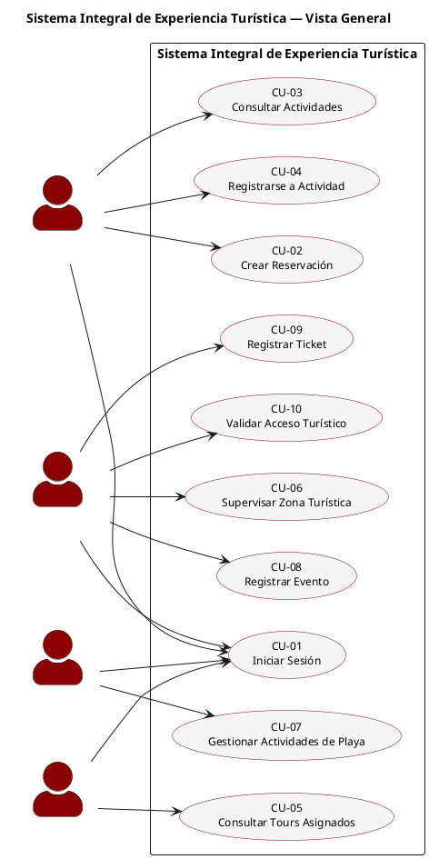
```plantuml
@startuml DCU-00_Vista_General
skinparam packageStyle rectangle
skinparam actorStyle awesome
skinparam usecase {
  BackgroundColor #F5F5F5
  BorderColor #8B0000
  FontSize 12
}
skinparam actor {
  BackgroundColor #8B0000
  FontColor white
}
left to right direction
title Sistema Integral de Experiencia Turística — Vista General

actor "Turista / Cliente\n[ACT-01]" as Turista
actor "Encargado Zona\nTurística [ACT-02]" as Encargado
actor "Encargado de\nPlaya [ACT-03]" as Playa
actor "Guía Turístico\n[ACT-04]" as Guia

rectangle "Sistema Integral de Experiencia Turística" {
  usecase "CU-01\nIniciar Sesión" as CU01
  usecase "CU-02\nCrear Reservación" as CU02
  usecase "CU-03\nConsultar Actividades" as CU03
  usecase "CU-04\nRegistrarse a Actividad" as CU04
  usecase "CU-05\nConsultar Tours Asignados" as CU05
  usecase "CU-06\nSupervisar Zona Turística" as CU06
  usecase "CU-07\nGestionar Actividades de Playa" as CU07
  usecase "CU-08\nRegistrar Evento" as CU08
  usecase "CU-09\nRegistrar Ticket" as CU09
  usecase "CU-10\nValidar Acceso Turístico" as CU10
}

Turista   --> CU01
Turista   --> CU02
Turista   --> CU03
Turista   --> CU04
Guia      --> CU01
Guia      --> CU05
Encargado --> CU01
Encargado --> CU06
Encargado --> CU08
Encargado --> CU09
Encargado --> CU10
Playa     --> CU01
Playa     --> CU07
@enduml
```

---

## DCU-01 — Gestión de Reservaciones

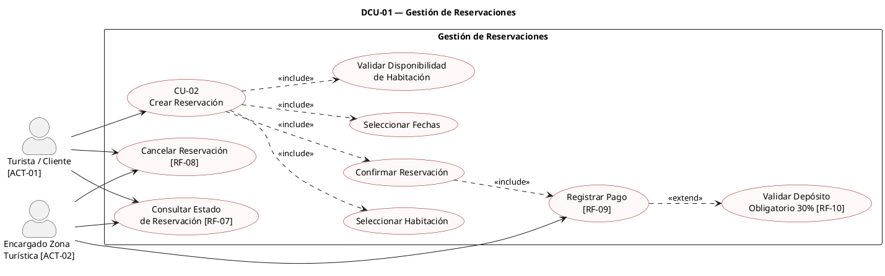
```plantuml
@startuml DCU-01_Gestion_Reservaciones
skinparam packageStyle rectangle
skinparam actorStyle awesome
skinparam usecase {
  BackgroundColor #FFF8F8
  BorderColor #8B0000
}
left to right direction
title DCU-01 — Gestión de Reservaciones

actor "Turista / Cliente\n[ACT-01]" as Turista
actor "Encargado Zona\nTurística [ACT-02]" as Encargado

rectangle "Gestión de Reservaciones" {
  usecase "CU-02\nCrear Reservación" as CU02
  usecase "Seleccionar Fechas" as CU_F
  usecase "Validar Disponibilidad\nde Habitación" as CU_D
  usecase "Seleccionar Habitación" as CU_H
  usecase "Confirmar Reservación" as CU_C
  usecase "Cancelar Reservación\n[RF-08]" as CU_CA
  usecase "Consultar Estado\nde Reservación [RF-07]" as CU_ES
  usecase "Registrar Pago\n[RF-09]" as CU_P
  usecase "Validar Depósito\nObligatorio 30% [RF-10]" as CU_DEP
}

Turista --> CU02
Turista --> CU_CA
Turista --> CU_ES

CU02  ..> CU_F   : <<include>>
CU02  ..> CU_D   : <<include>>
CU02  ..> CU_H   : <<include>>
CU02  ..> CU_C   : <<include>>
CU_C  ..> CU_P   : <<include>>
CU_P  ..> CU_DEP : <<extend>>

Encargado --> CU_CA
Encargado --> CU_ES
Encargado --> CU_P
@enduml
```

---

## DCU-02 — Gestión de Tours

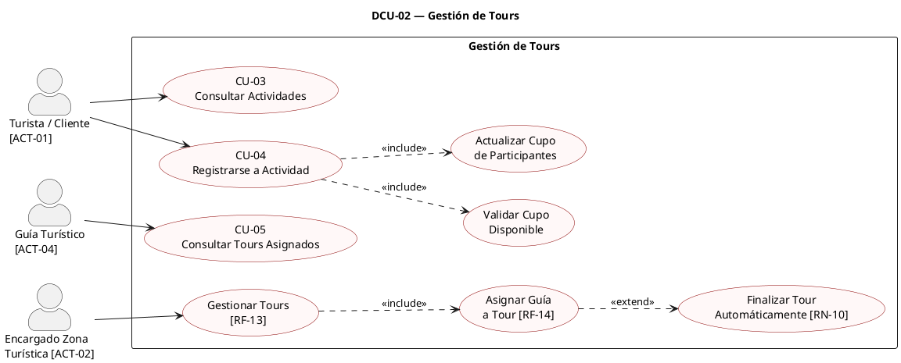
```plantuml
@startuml DCU-02_Gestion_Tours
skinparam packageStyle rectangle
skinparam actorStyle awesome
skinparam usecase {
  BackgroundColor #FFF8F8
  BorderColor #8B0000
}
left to right direction
title DCU-02 — Gestión de Tours

actor "Turista / Cliente\n[ACT-01]" as Turista
actor "Guía Turístico\n[ACT-04]" as Guia
actor "Encargado Zona\nTurística [ACT-02]" as Encargado

rectangle "Gestión de Tours" {
  usecase "CU-03\nConsultar Actividades" as CU03
  usecase "CU-04\nRegistrarse a Actividad" as CU04
  usecase "CU-05\nConsultar Tours Asignados" as CU05
  usecase "Gestionar Tours\n[RF-13]" as GestionarTours
  usecase "Asignar Guía\na Tour [RF-14]" as AsignarGuia
  usecase "Validar Cupo\nDisponible" as VCD
  usecase "Actualizar Cupo\nde Participantes" as AC
  usecase "Finalizar Tour\nAutomáticamente [RN-10]" as FAT
}

Turista   --> CU03
Turista   --> CU04
Guia      --> CU05
Encargado --> GestionarTours

CU04          ..> VCD        : <<include>>
CU04          ..> AC         : <<include>>
GestionarTours ..> AsignarGuia : <<include>>
AsignarGuia   ..> FAT        : <<extend>>
@enduml
```

---

## DCU-03 — Gestión de Playa

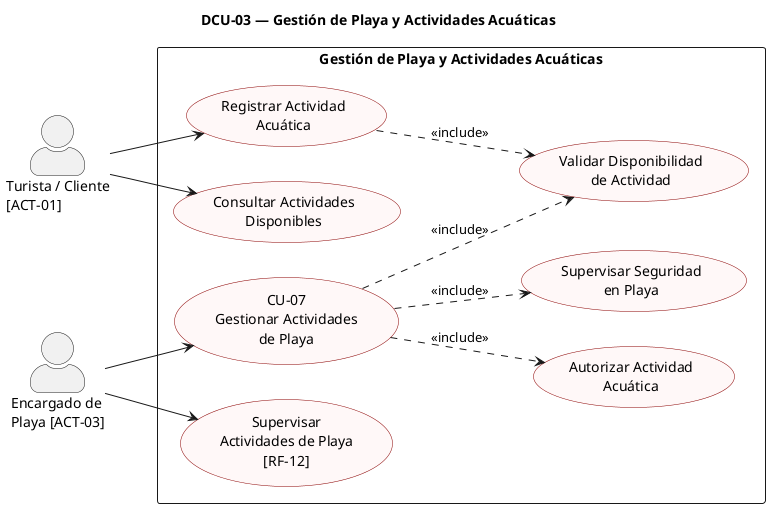
```plantuml
@startuml DCU-03_Gestion_Playa
skinparam packageStyle rectangle
skinparam actorStyle awesome
skinparam usecase {
  BackgroundColor #FFF8F8
  BorderColor #8B0000
}
left to right direction
title DCU-03 — Gestión de Playa y Actividades Acuáticas

actor "Turista / Cliente\n[ACT-01]" as Turista
actor "Encargado de\nPlaya [ACT-03]" as Playa

rectangle "Gestión de Playa y Actividades Acuáticas" {
  usecase "CU-07\nGestionar Actividades\nde Playa" as CU07
  usecase "Supervisar\nActividades de Playa\n[RF-12]" as SupervisarPlaya
  usecase "Autorizar Actividad\nAcuática" as AAC
  usecase "Validar Disponibilidad\nde Actividad" as VDA
  usecase "Supervisar Seguridad\nen Playa" as SSP
  usecase "Registrar Actividad\nAcuática" as RAA
  usecase "Consultar Actividades\nDisponibles" as CAD
}

Playa   --> CU07
Playa   --> SupervisarPlaya
Turista --> CAD
Turista --> RAA

CU07 ..> AAC : <<include>>
CU07 ..> VDA : <<include>>
CU07 ..> SSP : <<include>>
RAA  ..> VDA : <<include>>
@enduml
```

---

## DCU-04 — Gestión de Eventos

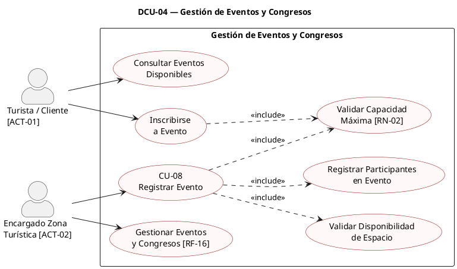
```plantuml
@startuml DCU-04_Gestion_Eventos
skinparam packageStyle rectangle
skinparam actorStyle awesome
skinparam usecase {
  BackgroundColor #FFF8F8
  BorderColor #8B0000
}
left to right direction
title DCU-04 — Gestión de Eventos y Congresos

actor "Turista / Cliente\n[ACT-01]" as Turista
actor "Encargado Zona\nTurística [ACT-02]" as Encargado

rectangle "Gestión de Eventos y Congresos" {
  usecase "CU-08\nRegistrar Evento" as CU08
  usecase "Gestionar Eventos\ny Congresos [RF-16]" as GestionarEventos
  usecase "Validar Disponibilidad\nde Espacio" as VDE
  usecase "Registrar Participantes\nen Evento" as RP
  usecase "Consultar Eventos\nDisponibles" as CED
  usecase "Inscribirse\na Evento" as IE
  usecase "Validar Capacidad\nMáxima [RN-02]" as VCM
}

Encargado --> CU08
Encargado --> GestionarEventos
Turista   --> CED
Turista   --> IE

CU08 ..> VDE : <<include>>
CU08 ..> RP  : <<include>>
CU08 ..> VCM : <<include>>
IE   ..> VCM : <<include>>
@enduml
```

---

## DCU-05 — Control de Acceso Turístico

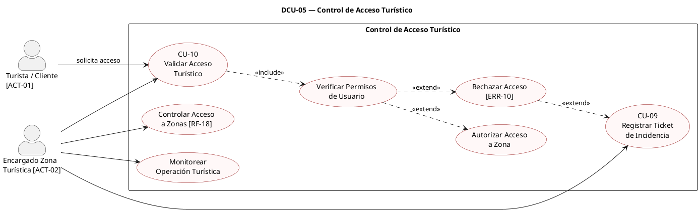
```plantuml
@startuml DCU-05_Control_Acceso
skinparam packageStyle rectangle
skinparam actorStyle awesome
skinparam usecase {
  BackgroundColor #FFF8F8
  BorderColor #8B0000
}
left to right direction
title DCU-05 — Control de Acceso Turístico

actor "Turista / Cliente\n[ACT-01]" as Turista
actor "Encargado Zona\nTurística [ACT-02]" as Encargado

rectangle "Control de Acceso Turístico" {
  usecase "CU-10\nValidar Acceso\nTurístico" as CU10
  usecase "Controlar Acceso\na Zonas [RF-18]" as ControlarAcceso
  usecase "Verificar Permisos\nde Usuario" as VPU
  usecase "Autorizar Acceso\na Zona" as AAZ
  usecase "Rechazar Acceso\n[ERR-10]" as RAZ
  usecase "CU-09\nRegistrar Ticket\nde Incidencia" as CU09
  usecase "Monitorear\nOperación Turística" as MOT
}

Turista   --> CU10 : solicita acceso
Encargado --> CU10
Encargado --> ControlarAcceso
Encargado --> CU09
Encargado --> MOT

CU10 ..> VPU  : <<include>>
VPU  ..> AAZ  : <<extend>>
VPU  ..> RAZ  : <<extend>>
RAZ  ..> CU09 : <<extend>>
@enduml
```

---

# ═══════════════════════════════════════════
# 2. DIAGRAMAS DE ACTIVIDADES
# ═══════════════════════════════════════════

---

## DA-01 — Creación de Reservación

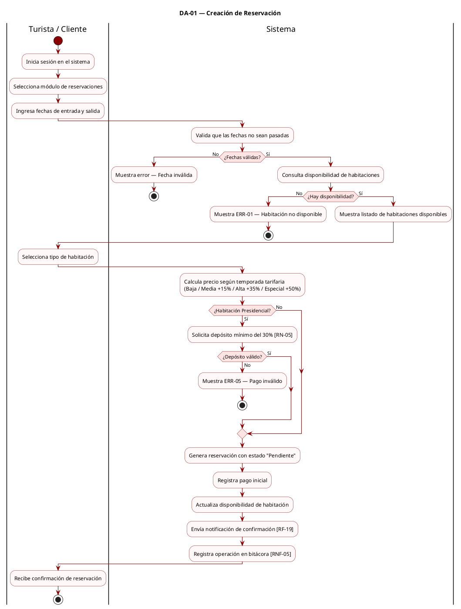
```plantuml
@startuml DA-01_Creacion_Reservacion
skinparam activity {
  BackgroundColor #FFF8F8
  BorderColor #8B0000
  DiamondBackgroundColor #FFE4E4
  DiamondBorderColor #8B0000
  StartColor #8B0000
  EndColor #8B0000
}
skinparam arrowColor #8B0000
title DA-01 — Creación de Reservación

|Turista / Cliente|
start
:Inicia sesión en el sistema;
:Selecciona módulo de reservaciones;
:Ingresa fechas de entrada y salida;

|Sistema|
:Valida que las fechas no sean pasadas;
if (¿Fechas válidas?) then (No)
  :Muestra error — Fecha inválida;
  stop
else (Sí)
  :Consulta disponibilidad de habitaciones;
  if (¿Hay disponibilidad?) then (No)
    :Muestra ERR-01 — Habitación no disponible;
    stop
  else (Sí)
    :Muestra listado de habitaciones disponibles;
  endif
endif

|Turista / Cliente|
:Selecciona tipo de habitación;

|Sistema|
:Calcula precio según temporada tarifaria\n(Baja / Media +15% / Alta +35% / Especial +50%);
if (¿Habitación Presidencial?) then (Sí)
  :Solicita depósito mínimo del 30% [RN-05];
  if (¿Depósito válido?) then (No)
    :Muestra ERR-05 — Pago inválido;
    stop
  else (Sí)
  endif
else (No)
endif
:Genera reservación con estado "Pendiente";
:Registra pago inicial;
:Actualiza disponibilidad de habitación;
:Envía notificación de confirmación [RF-19];
:Registra operación en bitácora [RNF-05];

|Turista / Cliente|
:Recibe confirmación de reservación;
stop
@enduml
```

---

## DA-02 — Registro de Actividades Turísticas

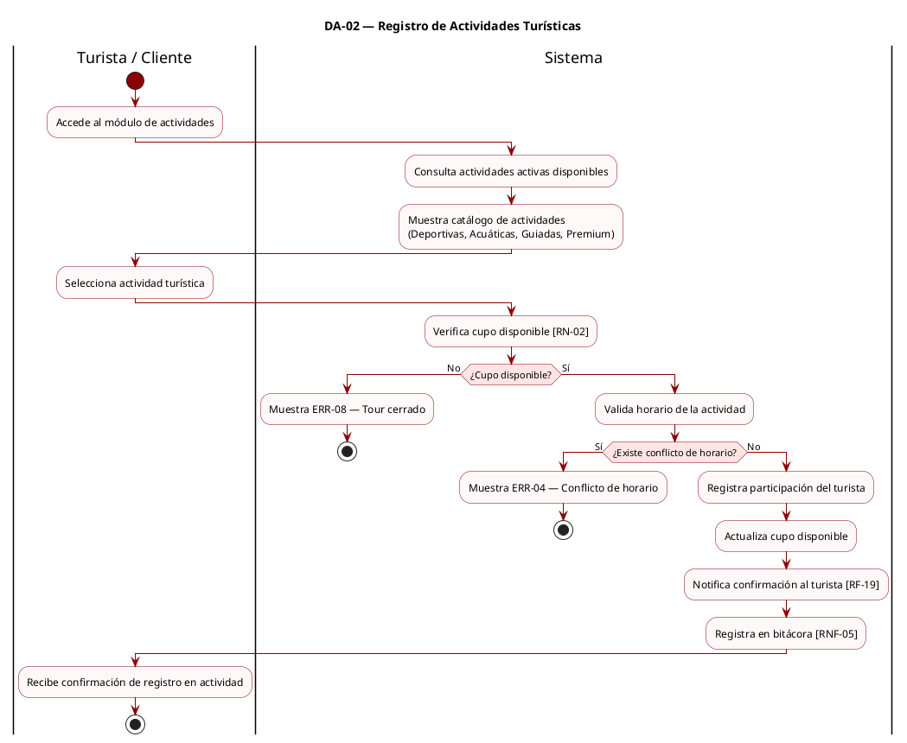
```plantuml
@startuml DA-02_Registro_Actividades
skinparam activity {
  BackgroundColor #FFF8F8
  BorderColor #8B0000
  DiamondBackgroundColor #FFE4E4
  DiamondBorderColor #8B0000
  StartColor #8B0000
  EndColor #8B0000
}
skinparam arrowColor #8B0000
title DA-02 — Registro de Actividades Turísticas

|Turista / Cliente|
start
:Accede al módulo de actividades;

|Sistema|
:Consulta actividades activas disponibles;
:Muestra catálogo de actividades\n(Deportivas, Acuáticas, Guiadas, Premium);

|Turista / Cliente|
:Selecciona actividad turística;

|Sistema|
:Verifica cupo disponible [RN-02];
if (¿Cupo disponible?) then (No)
  :Muestra ERR-08 — Tour cerrado;
  stop
else (Sí)
  :Valida horario de la actividad;
  if (¿Existe conflicto de horario?) then (Sí)
    :Muestra ERR-04 — Conflicto de horario;
    stop
  else (No)
    :Registra participación del turista;
    :Actualiza cupo disponible;
    :Notifica confirmación al turista [RF-19];
    :Registra en bitácora [RNF-05];
  endif
endif

|Turista / Cliente|
:Recibe confirmación de registro en actividad;
stop
@enduml
```

---

## DA-03 — Asignación Automática de Guías Turísticos

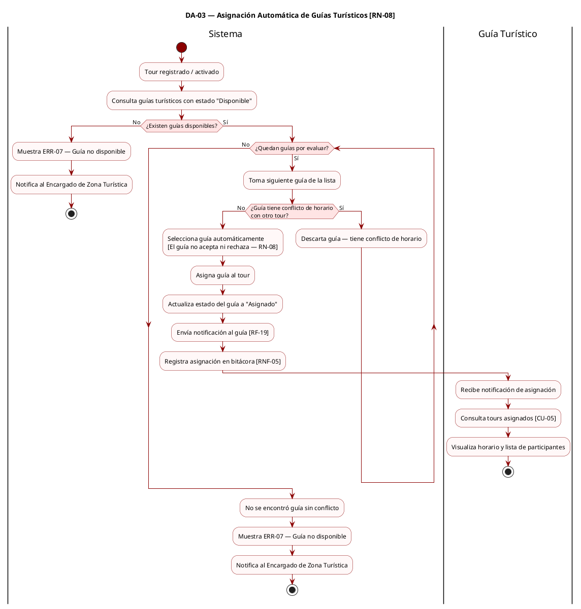
```plantuml
@startuml DA-03_Asignacion_Guias
skinparam activity {
  BackgroundColor #FFF8F8
  BorderColor #8B0000
  DiamondBackgroundColor #FFE4E4
  DiamondBorderColor #8B0000
  StartColor #8B0000
  EndColor #8B0000
}
skinparam arrowColor #8B0000
title DA-03 — Asignación Automática de Guías Turísticos [RN-08]

|Sistema|
start
:Tour registrado / activado;
:Consulta guías turísticos con estado "Disponible";

if (¿Existen guías disponibles?) then (No)
  :Muestra ERR-07 — Guía no disponible;
  :Notifica al Encargado de Zona Turística;
  stop
else (Sí)
  while (¿Quedan guías por evaluar?) is (Sí)
    |Sistema|
    :Toma siguiente guía de la lista;
    if (¿Guía tiene conflicto de horario\ncon otro tour?) then (No)
      |Sistema|
      :Selecciona guía automáticamente\n[El guía no acepta ni rechaza — RN-08];
      :Asigna guía al tour;
      :Actualiza estado del guía a "Asignado";
      :Envía notificación al guía [RF-19];
      :Registra asignación en bitácora [RNF-05];

      |Guía Turístico|
      :Recibe notificación de asignación;
      :Consulta tours asignados [CU-05];
      :Visualiza horario y lista de participantes;
      stop
    else (Sí)
      |Sistema|
      :Descarta guía — tiene conflicto de horario;
    endif
  endwhile (No)
  |Sistema|
  :No se encontró guía sin conflicto;
  :Muestra ERR-07 — Guía no disponible;
  :Notifica al Encargado de Zona Turística;
  stop
endif
@enduml
```

---

## DA-04 — Registro de Tickets de Incidencia

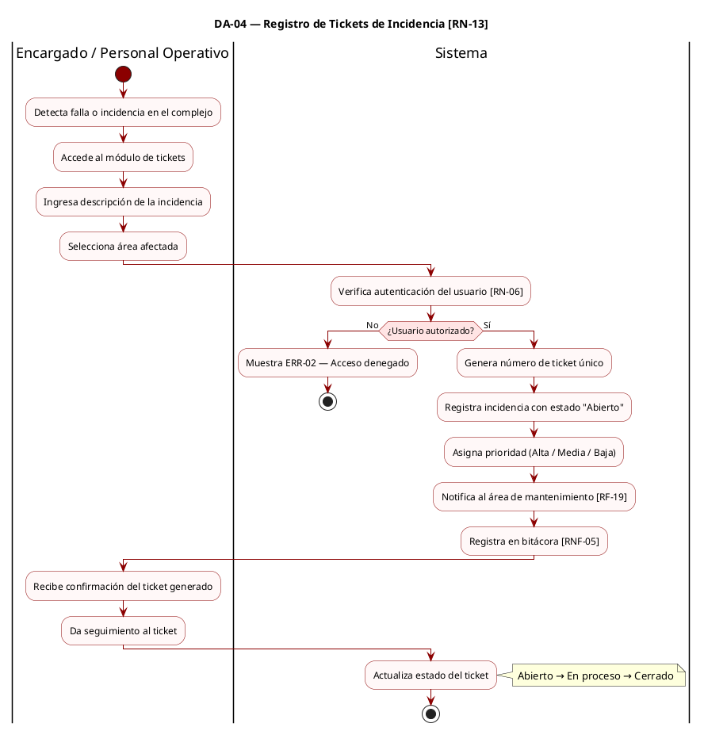
```plantuml
@startuml DA-04_Registro_Tickets
skinparam activity {
  BackgroundColor #FFF8F8
  BorderColor #8B0000
  DiamondBackgroundColor #FFE4E4
  DiamondBorderColor #8B0000
  StartColor #8B0000
  EndColor #8B0000
}
skinparam arrowColor #8B0000
title DA-04 — Registro de Tickets de Incidencia [RN-13]

|Encargado / Personal Operativo|
start
:Detecta falla o incidencia en el complejo;
:Accede al módulo de tickets;
:Ingresa descripción de la incidencia;
:Selecciona área afectada;

|Sistema|
:Verifica autenticación del usuario [RN-06];
if (¿Usuario autorizado?) then (No)
  :Muestra ERR-02 — Acceso denegado;
  stop
else (Sí)
  :Genera número de ticket único;
  :Registra incidencia con estado "Abierto";
  :Asigna prioridad (Alta / Media / Baja);
  :Notifica al área de mantenimiento [RF-19];
  :Registra en bitácora [RNF-05];
endif

|Encargado / Personal Operativo|
:Recibe confirmación del ticket generado;
:Da seguimiento al ticket;

|Sistema|
:Actualiza estado del ticket;
note right: Abierto → En proceso → Cerrado
stop
@enduml
```

---

## DA-05 — Validación de Acceso Turístico

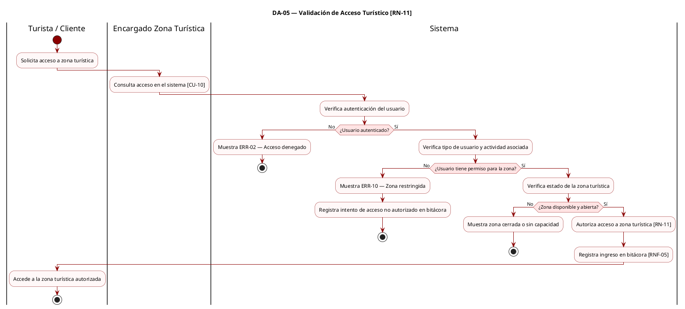
```plantuml
@startuml DA-05_Validacion_Acceso
skinparam activity {
  BackgroundColor #FFF8F8
  BorderColor #8B0000
  DiamondBackgroundColor #FFE4E4
  DiamondBorderColor #8B0000
  StartColor #8B0000
  EndColor #8B0000
}
skinparam arrowColor #8B0000
title DA-05 — Validación de Acceso Turístico [RN-11]

|Turista / Cliente|
start
:Solicita acceso a zona turística;

|Encargado Zona Turística|
:Consulta acceso en el sistema [CU-10];

|Sistema|
:Verifica autenticación del usuario;
if (¿Usuario autenticado?) then (No)
  :Muestra ERR-02 — Acceso denegado;
  stop
else (Sí)
  :Verifica tipo de usuario y actividad asociada;
  if (¿Usuario tiene permiso para la zona?) then (No)
    :Muestra ERR-10 — Zona restringida;
    :Registra intento de acceso no autorizado en bitácora;
    stop
  else (Sí)
    :Verifica estado de la zona turística;
    if (¿Zona disponible y abierta?) then (No)
      :Muestra zona cerrada o sin capacidad;
      stop
    else (Sí)
      :Autoriza acceso a zona turística [RN-11];
      :Registra ingreso en bitácora [RNF-05];
    endif
  endif
endif

|Turista / Cliente|
:Accede a la zona turística autorizada;
stop
@enduml
```

---

# ═══════════════════════════════════════════
# 3. DIAGRAMAS DE SECUENCIA
# ═══════════════════════════════════════════

---

## DS-01 — Inicio de Sesión

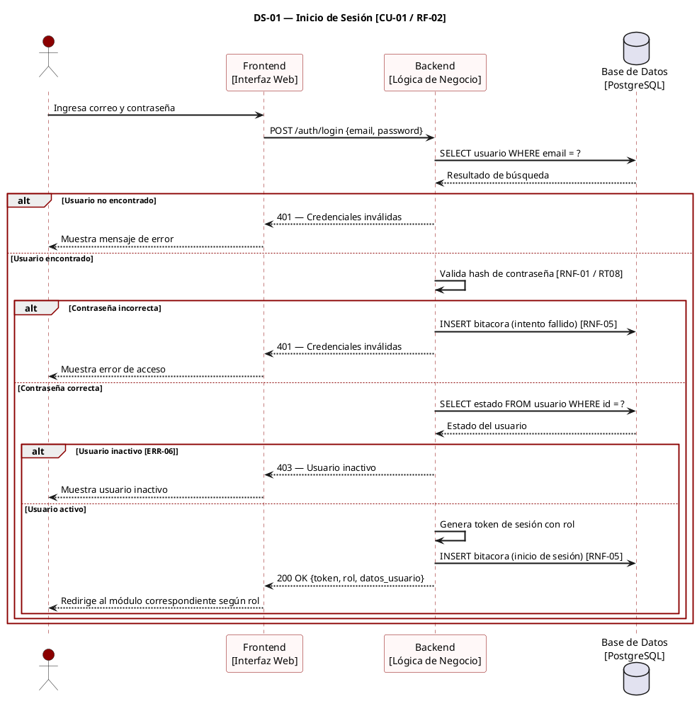
```plantuml
@startuml DS-01_Inicio_Sesion
skinparam sequenceArrowThickness 2
skinparam sequenceGroupBorderColor #8B0000
skinparam sequenceLifeLineBorderColor #8B0000
skinparam participant {
  BackgroundColor #FFF8F8
  BorderColor #8B0000
}
skinparam actor {
  BackgroundColor #8B0000
  FontColor white
}
title DS-01 — Inicio de Sesión [CU-01 / RF-02]

actor "Usuario" as U
participant "Frontend\n[Interfaz Web]" as FE
participant "Backend\n[Lógica de Negocio]" as BE
database "Base de Datos\n[PostgreSQL]" as DB

U -> FE  : Ingresa correo y contraseña
FE -> BE : POST /auth/login {email, password}
BE -> DB : SELECT usuario WHERE email = ?
DB --> BE : Resultado de búsqueda

alt Usuario no encontrado
  BE --> FE : 401 — Credenciales inválidas
  FE --> U  : Muestra mensaje de error
else Usuario encontrado
  BE -> BE : Valida hash de contraseña [RNF-01 / RT08]
  alt Contraseña incorrecta
    BE -> DB  : INSERT bitacora (intento fallido) [RNF-05]
    BE --> FE : 401 — Credenciales inválidas
    FE --> U  : Muestra error de acceso
  else Contraseña correcta
    BE -> DB  : SELECT estado FROM usuario WHERE id = ?
    DB --> BE : Estado del usuario
    alt Usuario inactivo [ERR-06]
      BE --> FE : 403 — Usuario inactivo
      FE --> U  : Muestra usuario inactivo
    else Usuario activo
      BE -> BE  : Genera token de sesión con rol
      BE -> DB  : INSERT bitacora (inicio de sesión) [RNF-05]
      BE --> FE : 200 OK {token, rol, datos_usuario}
      FE --> U  : Redirige al módulo correspondiente según rol
    end
  end
end
@enduml
```

---

## DS-02 — Crear Reservación

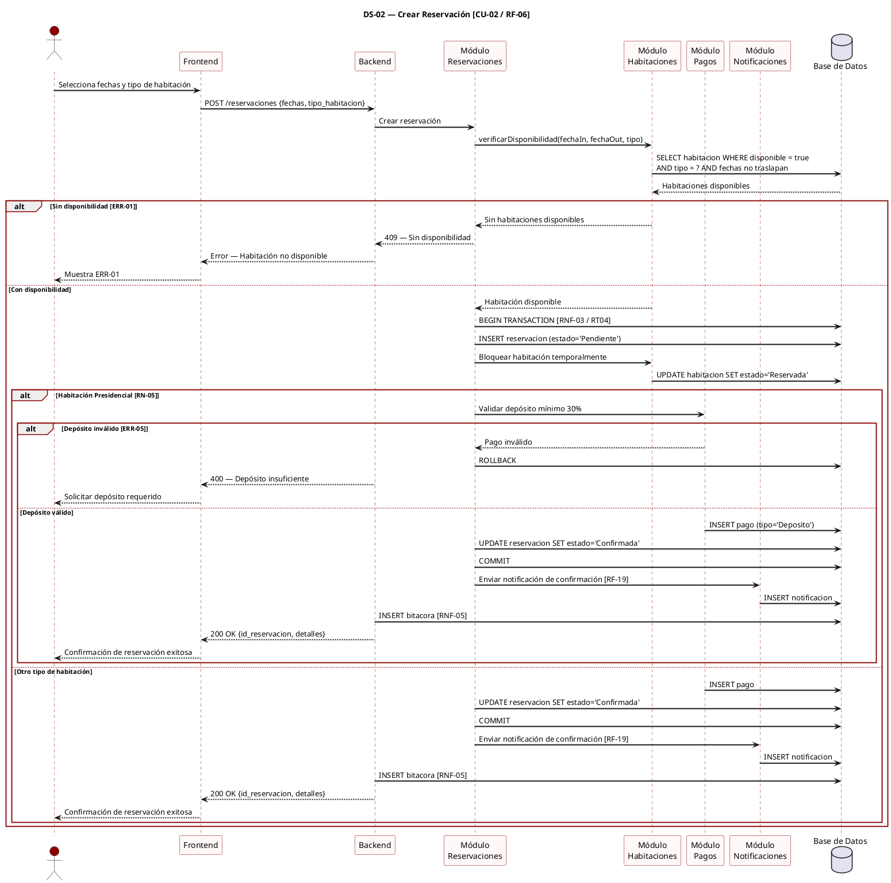
```plantuml
@startuml DS-02_Crear_Reservacion
skinparam sequenceArrowThickness 2
skinparam sequenceGroupBorderColor #8B0000
skinparam sequenceLifeLineBorderColor #8B0000
skinparam participant {
  BackgroundColor #FFF8F8
  BorderColor #8B0000
}
skinparam actor {
  BackgroundColor #8B0000
  FontColor white
}
title DS-02 — Crear Reservación [CU-02 / RF-06]

actor "Turista / Cliente" as T
participant "Frontend" as FE
participant "Backend" as BE
participant "Módulo\nReservaciones" as MR
participant "Módulo\nHabitaciones" as MH
participant "Módulo\nPagos" as MP
participant "Módulo\nNotificaciones" as MN
database "Base de Datos" as DB

T  -> FE : Selecciona fechas y tipo de habitación
FE -> BE : POST /reservaciones {fechas, tipo_habitacion}
BE -> MR : Crear reservación

MR -> MH : verificarDisponibilidad(fechaIn, fechaOut, tipo)
MH -> DB : SELECT habitacion WHERE disponible = true\nAND tipo = ? AND fechas no traslapan
DB --> MH : Habitaciones disponibles

alt Sin disponibilidad [ERR-01]
  MH --> MR  : Sin habitaciones disponibles
  MR --> BE  : 409 — Sin disponibilidad
  BE --> FE  : Error — Habitación no disponible
  FE --> T   : Muestra ERR-01
else Con disponibilidad
  MH --> MR  : Habitación disponible
  MR -> DB   : BEGIN TRANSACTION [RNF-03 / RT04]
  MR -> DB   : INSERT reservacion (estado='Pendiente')
  MR -> MH   : Bloquear habitación temporalmente
  MH -> DB   : UPDATE habitacion SET estado='Reservada'

  alt Habitación Presidencial [RN-05]
    MR -> MP : Validar depósito mínimo 30%
    alt Depósito inválido [ERR-05]
      MP --> MR  : Pago inválido
      MR -> DB   : ROLLBACK
      BE --> FE  : 400 — Depósito insuficiente
      FE --> T   : Solicitar depósito requerido
    else Depósito válido
      MP -> DB   : INSERT pago (tipo='Deposito')
      MR -> DB   : UPDATE reservacion SET estado='Confirmada'
      MR -> DB   : COMMIT
      MR -> MN   : Enviar notificación de confirmación [RF-19]
      MN -> DB   : INSERT notificacion
      BE -> DB   : INSERT bitacora [RNF-05]
      BE --> FE  : 200 OK {id_reservacion, detalles}
      FE --> T   : Confirmación de reservación exitosa
    end
  else Otro tipo de habitación
    MP -> DB   : INSERT pago
    MR -> DB   : UPDATE reservacion SET estado='Confirmada'
    MR -> DB   : COMMIT
    MR -> MN   : Enviar notificación de confirmación [RF-19]
    MN -> DB   : INSERT notificacion
    BE -> DB   : INSERT bitacora [RNF-05]
    BE --> FE  : 200 OK {id_reservacion, detalles}
    FE --> T   : Confirmación de reservación exitosa
  end
end
@enduml
```

---

## DS-03 — Registrar Actividad Turística

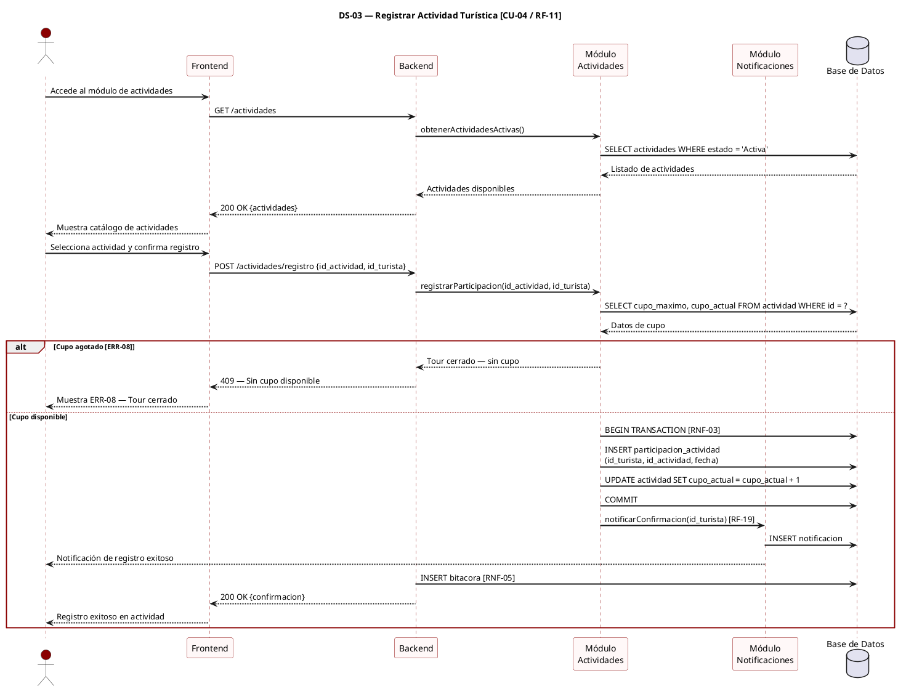
```plantuml
@startuml DS-03_Registrar_Actividad
skinparam sequenceArrowThickness 2
skinparam sequenceGroupBorderColor #8B0000
skinparam sequenceLifeLineBorderColor #8B0000
skinparam participant {
  BackgroundColor #FFF8F8
  BorderColor #8B0000
}
skinparam actor {
  BackgroundColor #8B0000
  FontColor white
}
title DS-03 — Registrar Actividad Turística [CU-04 / RF-11]

actor "Turista / Cliente" as T
participant "Frontend" as FE
participant "Backend" as BE
participant "Módulo\nActividades" as MA
participant "Módulo\nNotificaciones" as MN
database "Base de Datos" as DB

T  -> FE  : Accede al módulo de actividades
FE -> BE  : GET /actividades
BE -> MA  : obtenerActividadesActivas()
MA -> DB  : SELECT actividades WHERE estado = 'Activa'
DB --> MA : Listado de actividades
MA --> BE : Actividades disponibles
BE --> FE : 200 OK {actividades}
FE --> T  : Muestra catálogo de actividades

T  -> FE  : Selecciona actividad y confirma registro
FE -> BE  : POST /actividades/registro {id_actividad, id_turista}
BE -> MA  : registrarParticipacion(id_actividad, id_turista)
MA -> DB  : SELECT cupo_maximo, cupo_actual FROM actividad WHERE id = ?
DB --> MA : Datos de cupo

alt Cupo agotado [ERR-08]
  MA --> BE : Tour cerrado — sin cupo
  BE --> FE : 409 — Sin cupo disponible
  FE --> T  : Muestra ERR-08 — Tour cerrado
else Cupo disponible
  MA -> DB   : BEGIN TRANSACTION [RNF-03]
  MA -> DB   : INSERT participacion_actividad\n(id_turista, id_actividad, fecha)
  MA -> DB   : UPDATE actividad SET cupo_actual = cupo_actual + 1
  MA -> DB   : COMMIT
  MA -> MN   : notificarConfirmacion(id_turista) [RF-19]
  MN -> DB   : INSERT notificacion
  MN --> T   : Notificación de registro exitoso
  BE -> DB   : INSERT bitacora [RNF-05]
  BE --> FE  : 200 OK {confirmacion}
  FE --> T   : Registro exitoso en actividad
end
@enduml
```

---

## DS-04 — Asignación Automática de Guías

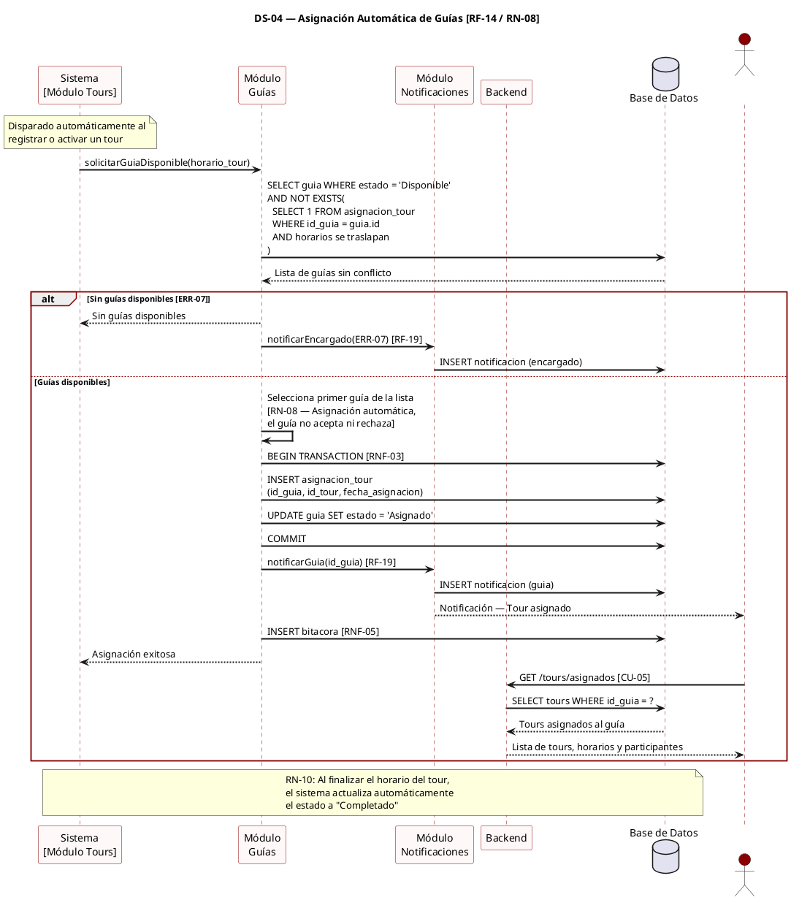
```plantuml
@startuml DS-04_Asignar_Guia
skinparam sequenceArrowThickness 2
skinparam sequenceGroupBorderColor #8B0000
skinparam sequenceLifeLineBorderColor #8B0000
skinparam participant {
  BackgroundColor #FFF8F8
  BorderColor #8B0000
}
skinparam actor {
  BackgroundColor #8B0000
  FontColor white
}
title DS-04 — Asignación Automática de Guías [RF-14 / RN-08]

participant "Sistema\n[Módulo Tours]" as ST
participant "Módulo\nGuías" as MG
participant "Módulo\nNotificaciones" as MN
participant "Backend" as BE
database "Base de Datos" as DB
actor "Guía Turístico\n[ACT-04]" as G

note over ST
  Disparado automáticamente al
  registrar o activar un tour
end note

ST -> MG  : solicitarGuiaDisponible(horario_tour)
MG -> DB  : SELECT guia WHERE estado = 'Disponible'\nAND NOT EXISTS(\n  SELECT 1 FROM asignacion_tour\n  WHERE id_guia = guia.id\n  AND horarios se traslapan\n)
DB --> MG : Lista de guías sin conflicto

alt Sin guías disponibles [ERR-07]
  MG --> ST  : Sin guías disponibles
  MG -> MN   : notificarEncargado(ERR-07) [RF-19]
  MN -> DB   : INSERT notificacion (encargado)
else Guías disponibles
  MG -> MG   : Selecciona primer guía de la lista\n[RN-08 — Asignación automática,\nel guía no acepta ni rechaza]
  MG -> DB   : BEGIN TRANSACTION [RNF-03]
  MG -> DB   : INSERT asignacion_tour\n(id_guia, id_tour, fecha_asignacion)
  MG -> DB   : UPDATE guia SET estado = 'Asignado'
  MG -> DB   : COMMIT
  MG -> MN   : notificarGuia(id_guia) [RF-19]
  MN -> DB   : INSERT notificacion (guia)
  MN --> G   : Notificación — Tour asignado
  MG -> DB   : INSERT bitacora [RNF-05]
  MG --> ST  : Asignación exitosa

  G  -> BE   : GET /tours/asignados [CU-05]
  BE -> DB   : SELECT tours WHERE id_guia = ?
  DB --> BE  : Tours asignados al guía
  BE --> G   : Lista de tours, horarios y participantes
end

note over ST, DB
  RN-10: Al finalizar el horario del tour,
  el sistema actualiza automáticamente
  el estado a "Completado"
end note
@enduml
```

---

## DS-05 — Registrar Evento

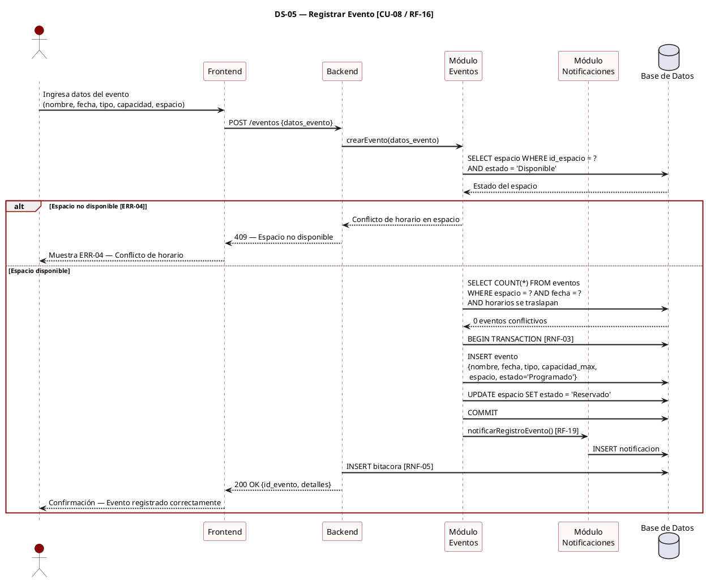
```plantuml
@startuml DS-05_Registrar_Evento
skinparam sequenceArrowThickness 2
skinparam sequenceGroupBorderColor #8B0000
skinparam sequenceLifeLineBorderColor #8B0000
skinparam participant {
  BackgroundColor #FFF8F8
  BorderColor #8B0000
}
skinparam actor {
  BackgroundColor #8B0000
  FontColor white
}
title DS-05 — Registrar Evento [CU-08 / RF-16]

actor "Encargado\nZona Turística" as E
participant "Frontend" as FE
participant "Backend" as BE
participant "Módulo\nEventos" as ME
participant "Módulo\nNotificaciones" as MN
database "Base de Datos" as DB

E  -> FE  : Ingresa datos del evento\n(nombre, fecha, tipo, capacidad, espacio)
FE -> BE  : POST /eventos {datos_evento}
BE -> ME  : crearEvento(datos_evento)

ME -> DB  : SELECT espacio WHERE id_espacio = ?\nAND estado = 'Disponible'
DB --> ME : Estado del espacio

alt Espacio no disponible [ERR-04]
  ME --> BE : Conflicto de horario en espacio
  BE --> FE : 409 — Espacio no disponible
  FE --> E  : Muestra ERR-04 — Conflicto de horario
else Espacio disponible
  ME -> DB  : SELECT COUNT(*) FROM eventos\nWHERE espacio = ? AND fecha = ?\nAND horarios se traslapan
  DB --> ME : 0 eventos conflictivos
  ME -> DB  : BEGIN TRANSACTION [RNF-03]
  ME -> DB  : INSERT evento\n{nombre, fecha, tipo, capacidad_max,\n espacio, estado='Programado'}
  ME -> DB  : UPDATE espacio SET estado = 'Reservado'
  ME -> DB  : COMMIT
  ME -> MN  : notificarRegistroEvento() [RF-19]
  MN -> DB  : INSERT notificacion
  BE -> DB  : INSERT bitacora [RNF-05]
  BE --> FE : 200 OK {id_evento, detalles}
  FE --> E  : Confirmación — Evento registrado correctamente
end
@enduml
```

---

# ═══════════════════════════════════════════
# 4. DIAGRAMA DE CLASES
# ═══════════════════════════════════════════

---

## Diagrama de Clases — Estructura Lógica del Sistema

```plantuml
@startuml Diagrama_Clases_SIET
skinparam class {
  BackgroundColor #FFFAFA
  BorderColor #8B0000
  HeaderBackgroundColor #8B0000
  HeaderFontColor #FFFFFF
  FontSize 11
  FontName Arial
}
skinparam package {
  BackgroundColor #FFF5F5
  BorderColor #CC0000
  FontColor #8B0000
  FontSize 12
  FontStyle bold
}
skinparam arrow {
  Color #8B0000
  FontColor #333333
  FontSize 10
}
skinparam shadowing false
title Diagrama de Clases — Sistema Integral de Experiencia Turística

' =========================================================
' PAQUETE 1 — USUARIOS Y ACCESO
' =========================================================
package "Usuarios y Acceso" {

  class Usuario {
    - id_usuario    : Integer <<PK>>
    - nombre        : String
    - apellido      : String
    - email         : String <<UNIQUE>>
    - password_hash : String
    - telefono      : String
    - estado        : Enum {Activo, Inactivo}
    - fecha_registro: DateTime
    ==
    + iniciarSesion(email, password) : Token
    + cerrarSesion() : void
    + consultarReservaciones() : List<Reservacion>
    + consultarActividades() : List<Actividad>
  }

  class Rol {
    - id_rol     : Integer <<PK>>
    - nombre     : Enum {Turista, EncargadoZona,\n  EncargadoPlaya, GuiaTuristico, Admin}
    - descripcion: String
    ==
    + tienePermiso(accion : String) : Boolean
  }

  class GuiaTuristico {
    - id_guia     : Integer <<PK>>
    - especialidad: String
    - estado      : Enum {Disponible, Asignado, Inactivo}
    ==
    + consultarToursAsignados() : List<Tour>
    + verificarDisponibilidad(horario : Time) : Boolean
    + actualizarEstado(estado : String) : void
  }

}

' =========================================================
' PAQUETE 2 — HOSPEDAJE
' =========================================================
package "Hospedaje" {

  class Habitacion {
    - id_habitacion: Integer <<PK>>
    - numero       : String
    - edificio     : Enum {A, B, C}
    - tipo         : Enum {Estandar, Doble, VistaMar,\n  JuniorSuite, Ejecutiva, Presidencial}
    - capacidad    : Integer
    - precio_base  : Decimal
    - estado       : Enum {Disponible, Reservada,\n  Mantenimiento, Limpieza}
    ==
    + verificarDisponibilidad(fechaIn, fechaOut) : Boolean
    + calcularPrecio(temporada : Temporada) : Decimal
    + cambiarEstado(nuevoEstado : String) : void
  }

  class Temporada {
    - id_temporada         : Integer <<PK>>
    - nombre               : Enum {Baja, Media, Alta, Especial}
    - incremento_porcentaje: Decimal
    - fecha_inicio         : Date
    - fecha_fin            : Date
    ==
    + calcularIncremento(precio_base : Decimal) : Decimal
    + estaActiva(fecha : Date) : Boolean
  }

  class Reservacion {
    - id_reservacion : Integer <<PK>>
    - fecha_check_in : Date
    - fecha_check_out: Date
    - estado         : Enum {Pendiente, Confirmada,\n  Cancelada, NoShow, Completada}
    - total          : Decimal
    - fecha_creacion : DateTime
    ==
    + confirmar() : void
    + cancelar() : void
    + calcularTotal(temporada : Temporada) : Decimal
    + generarNoShow() : void
  }

  class Pago {
    - id_pago   : Integer <<PK>>
    - monto     : Decimal
    - tipo      : Enum {Deposito, Abono, Total}
    - estado    : Enum {Valido, Revertido}
    - fecha_pago: DateTime
    - concepto  : String
    ==
    + registrar() : void
    + revertir() : void
    + validarDeposito(porcentaje : Decimal) : Boolean
  }

}

' =========================================================
' PAQUETE 3 — ACTIVIDADES TURÍSTICAS
' =========================================================
package "Actividades Turísticas" {

  class Actividad {
    - id_actividad    : Integer <<PK>>
    - nombre          : String
    - tipo            : Enum {Deportiva, Acuatica,\n  Guiada, Premium}
    - descripcion     : String
    - cupo_maximo     : Integer
    - cupo_actual     : Integer
    - horario         : Time
    - duracion_minutos: Integer
    - precio          : Decimal
    - estado          : Enum {Activa, Cancelada, Completada}
    ==
    + verificarCupo() : Boolean
    + actualizarCupo() : void
    + cancelar() : void
  }

  class Tour {
    - id_tour    : Integer <<PK>>
    - nombre     : String
    - fecha      : Date
    - hora_inicio: Time
    - hora_fin   : Time
    - cupo_maximo: Integer
    - cupo_actual: Integer
    - estado     : Enum {Programado, EnCurso,\n  Completado, Cancelado}
    ==
    + iniciar() : void
    + completarAutomaticamente() : void
    + cancelar() : void
    + verificarCupo() : Boolean
  }

  class ParticipacionActividad {
    - id_participacion: Integer <<PK>>
    - fecha_registro  : DateTime
    - estado          : Enum {Activa, Cancelada}
  }

  class ParticipacionTour {
    - id_participacion: Integer <<PK>>
    - fecha_registro  : DateTime
    - estado          : Enum {Activa, Cancelada}
  }

}

' =========================================================
' PAQUETE 4 — EVENTOS
' =========================================================
package "Eventos" {

  class Evento {
    - id_evento             : Integer <<PK>>
    - nombre                : String
    - tipo                  : Enum {Social, Congreso,\n  Academico, Feria, Presentacion}
    - fecha                 : Date
    - hora_inicio           : Time
    - hora_fin              : Time
    - capacidad_maxima      : Integer
    - participantes_actuales: Integer
    - espacio               : String
    - estado                : Enum {Programado, EnCurso,\n  Completado, Cancelado}
    ==
    + verificarCapacidad() : Boolean
    + cancelar() : void
  }

  class ParticipacionEvento {
    - id_participacion : Integer <<PK>>
    - fecha_inscripcion: DateTime
    - estado           : Enum {Inscrito, Cancelado}
  }

}

' =========================================================
' PAQUETE 5 — INFRAESTRUCTURA
' =========================================================
package "Infraestructura" {

  class Alberca {
    - id_alberca      : Integer <<PK>>
    - nombre          : Enum {Principal, Familiar,\n  Infantil, Relajacion, Deportiva}
    - capacidad_maxima: Integer
    - ocupacion_actual: Integer
    - funcion         : String
    - estado          : Enum {Abierta, Cerrada, Mantenimiento}
    ==
    + verificarDisponibilidad() : Boolean
    + registrarAcceso(usuario : Usuario) : void
    + cerrar() : void
  }

}

' =========================================================
' PAQUETE 6 — OPERACIÓN INTERNA
' =========================================================
package "Operación Interna" {

  class Ticket {
    - id_ticket     : Integer <<PK>>
    - descripcion   : String
    - area_afectada : String
    - estado        : Enum {Abierto, EnProceso, Cerrado}
    - prioridad     : Enum {Alta, Media, Baja}
    - fecha_creacion: DateTime
    - fecha_cierre  : DateTime
    ==
    + crear() : void
    + actualizarEstado(nuevoEstado : String) : void
    + cerrar() : void
  }

  class Notificacion {
    - id_notificacion: Integer <<PK>>
    - mensaje        : String
    - tipo           : Enum {Confirmacion, Recordatorio,\n  Alerta, Asignacion}
    - estado         : Enum {Pendiente, Enviada, Leida}
    - fecha_envio    : DateTime
    ==
    + enviar() : void
    + marcarLeida() : void
  }

  class Bitacora {
    - id_bitacora: Integer <<PK>>
    - accion     : String
    - modulo     : String
    - fecha_hora : DateTime
    - ip_origen  : String
    - detalle    : String
    ==
    + registrar(accion, modulo, usuario) : void
  }

}

' =========================================================
' RELACIONES
' =========================================================

' Usuarios y Acceso
GuiaTuristico  --|>  Usuario              : extiende
Usuario   "N"  -->  "1" Rol              : tiene >

' Hospedaje
Usuario      "1"  -->  "N" Reservacion   : realiza >
Reservacion  "N"  -->  "1" Habitacion    : incluye >
Reservacion  "N"  -->  "1" Temporada     : aplica >
Reservacion  "1"  -->  "N" Pago          : genera >

' Actividades Turísticas
Actividad "1"  -->  "N" Tour             : genera >
Tour      "N"  -->  "1" GuiaTuristico    : asignado a >

Usuario   "1"  -->  "N" ParticipacionActividad : tiene >
Actividad "1"  -->  "N" ParticipacionActividad : registra >

Usuario   "1"  -->  "N" ParticipacionTour : tiene >
Tour      "1"  -->  "N" ParticipacionTour : registra >

' Eventos
Usuario "1"  -->  "N" ParticipacionEvento : tiene >
Evento  "1"  -->  "N" ParticipacionEvento : registra >

' Operación Interna
Ticket       "N"  -->  "1" Usuario  : generado por >
Notificacion "N"  -->  "1" Usuario  : recibe >
Bitacora     "N"  -->  "1" Usuario  : generada por >
Alberca      "1"  -->  "N" Bitacora : registra accesos >

@enduml
```

---

*Sistema Integral de Experiencia Turística — ESCOM / IPN*
*17 diagramas PlantUML — Verificado contra documento original*
